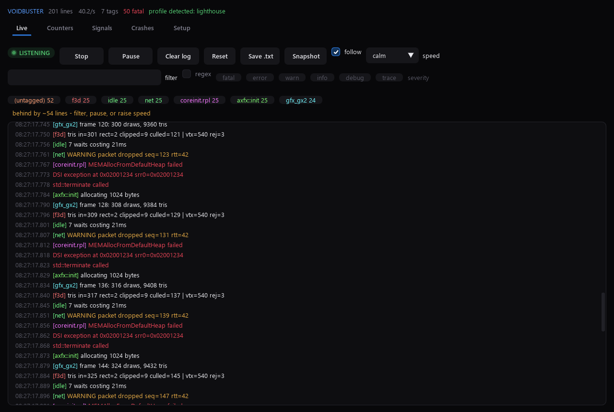
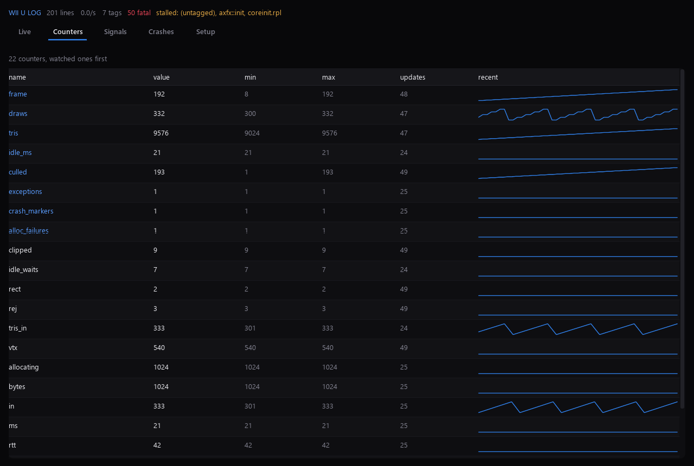
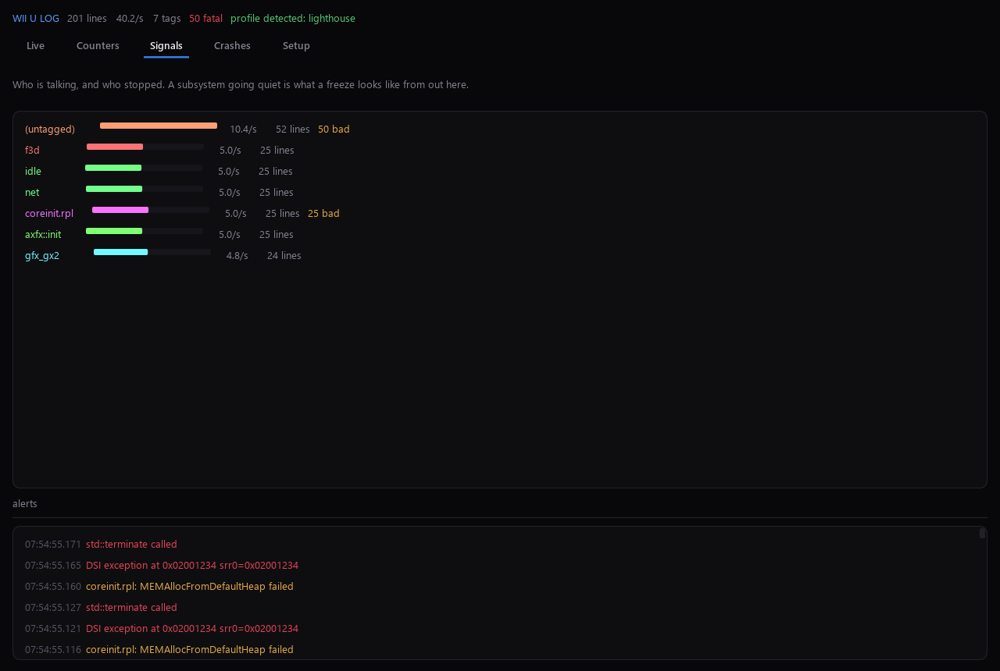

# VoidBuster

A log viewer for **any** Wii U title, rather than one game's dashboard.

The Lighthouse dashboard in `bk-wiiu/dashboard.py` parses four hardcoded
regexes. Point it at a different game and the log still scrolls, but the
counters stay empty and nothing is tagged, because nothing in that game emits
`[gfx_gx2] frame N: ...`. This tool inverts that: the structure is derived from
the text, so a game nobody has ever profiled still gets tags, severities,
colours and live counters. Profiles then add precision on top, and are never
required.

```
python voidbuster.py                      the window
python voidbuster.py --sweep              which port is this game logging on?
python voidbuster.py --quiet --stats 2    counters only, every 2s
python voidbuster.py --replay old.log     read a session back
python voidbuster.py --host 10.0.0.5 --only-host
python voidbuster.py --help
```



## What it captures

| source | what it is |
|---|---|
| UDP | `WHBLogUdp` from anything built with wut, **and Aroma's logging module**, which redirects `OSReport`/`OSConsoleWrite` — that is what makes retail titles log without being rebuilt. Default 4405, broadcast. |
| TCP | the same module's stream mode, and a few standalone loggers. `--tcp PORT` |
| file | an SD capture or a previous session. `--file PATH`, or `--replay PATH` to read one from the start and exit. |
| FTP | crash dumps out of `sd:/wiiu/crash_logs`. |

Several UDP ports are bound at once, so a title logging somewhere unexpected is
caught without a restart. Datagrams that split or batch lines are reassembled;
a fragment with no newline is held briefly and then emitted, so the last line
before a freeze is not lost.

## What it derives, with no configuration

- **Tags** from `[gfx]`, `[net][anchor]`, `AXFX::Init:` and `main.c:88:`
  prefixes. Each gets a stable colour hashed from its name, so the same
  subsystem is the same colour in every session.
- **Severity** from what the line says — `assertion failed` is fatal, `packet
  dropped` is a warning — not from a level field the game never wrote.
- **Counters** from every numeric shape logs actually use: `draws=340`,
  `340 draws`, and `frame 12`. Hex addresses are excluded, and a stoplist keeps
  a line of English prose from filling the table with `the` and `of`.
- **Rates and stalls.** Every tag is metered over a five second window. A tag
  that was talking and goes quiet is called out — on this console that is what
  a freeze looks like from the outside, and it is visible before anything
  crashes.



## Recording

Every session is written to `logs/` as lines arrive, always, with no button to
press. A hard freeze does not give you the chance to save, and the session you
forgot to save is the one you needed. A fatal line also writes the 400 lines
around it to `crash_logs/` on its own.

**Save .txt** on the Live tab writes what is on screen to `logs/saved-*.txt` —
the filtered view, not the whole buffer, with a header recording which filter
produced it. Narrowing to the one subsystem that misbehaves and saving that is
usually what you want to send to someone else.

## Reading a live log

The view eases toward the bottom rather than snapping to it, and the **speed**
picker caps how fast text is allowed to cross the screen:

| | px/s | roughly |
|---|---|---|
| calm (default) | 140 | 7 lines a second |
| steady | 260 | 13 lines a second |
| quick | 520 | 26 lines a second |
| snap | — | straight to the bottom, no glide |

The cap is the part that makes a live log readable. Easing on its own moves
faster the further behind it is, which is exactly the case where you want it
slow — a burst of two hundred lines arrives as a blur no matter how smooth the
interpolation. A ceiling in pixels per second means the text never outruns you.

The glide runs at a fixed rate per second, so it looks the same at 9fps or 60,
and it hands over the moment you touch the wheel or the scrollbar — scroll back
to the bottom and it takes hold again.

When the console is louder than the cap, the view says **behind by ~N lines**
rather than silently trailing. That is the signal to filter, pause, or raise
the speed; past a couple of screens it stops pretending and jumps.

**Pause** freezes the view at the line it was pressed on and shows how far
behind you are. Lines keep arriving, keep counting and keep being recorded;
pausing is about reading, not about dropping evidence.

**Clear log** empties the view; counters, tags and the recording carry on.
**Reset** clears everything — lines, counters, tags, alerts — and starts a new
recording file, which is what you want when you swap games rather than
restarting the tool.

## Your console

Set the console's IP once in **Setup > console**; the Crashes tab and the FTP
fetch both read it, and any address the logger has already heard from is
offered as a one-click fill.

**only accept lines from this address** is off by default — most people have
one console, and pinning the address only costs them a confusing empty window
when it changes. Turn it on when two consoles are on the network, or when
something else is broadcasting on the same port. The logger's own notices are
never filtered out, since they are what explains an otherwise empty window.

```bash
python voidbuster.py --host 192.168.1.110 --only-host
python voidbuster.py --host 192.168.1.110 --crashes
```

## Appearance and sound

**Setup > appearance**, applied as you change them and saved with everything
else — a theme you cannot see until next launch is no way to pick a theme.

- **theme** — `noir-blue`, `noir-red`, `slate-lime`, and an **accent** swatch
  that overrides the preset's own. The bright and dim variants are derived, so
  there is one colour to pick rather than three to keep consistent.
- **text size** — 0.75x to 1.75x.
- **row spacing** — compact, normal or roomy. The biggest lever on how much of
  a session fits on screen.
- **monospaced log** — timestamps and numbers line up into columns.
- **timestamps** and **tag column** — turn either off to widen the message.

**interface sounds** is a plain on/off with a volume slider next to it. Off is
off: nothing is synthesised and no audio thread starts.

## Profiles

Optional JSON in `profiles/`. `_base.json` is always applied — `OSFatal`, DSI
and ISI exceptions, allocation failures, RPL loads, Cafe result codes — and a
game profile stacks on top of it. The right one is chosen automatically by
scoring its `match` patterns against the first few hundred lines, so swapping
games generally needs no input.

```json
{
  "name": "mygame",
  "match": ["\\[mygame\\]"],
  "rules": [
    { "re": "\\[mygame\\] frame (?P<frame>\\d+) (?P<ms>\\d+)ms", "label": "frame" },
    { "re": "OUT OF ARENA", "level": "fatal", "count": "arena_oom", "alert": true }
  ],
  "tags":  { "mygame": "#5ad0ff" },
  "watch": ["frame", "ms", "arena_oom"]
}
```

Named capture groups become counters. `count` bumps a running total, `level`
overrides the guessed severity, `alert` surfaces the line in the Signals tab,
`watch` pins counters to the top of the table. `profiles/lighthouse.json`
carries the Banjo-Kazooie counters across from the old dashboard, so a
Lighthouse session looks the same in either tool.

## Crashes

`--crashes 192.168.1.110` pulls dumps over FTP; the Crashes tab does the same
with a button. Dumps are parsed by shape rather than by format — registers look
like registers and addresses look like addresses — because crash logger output
has changed between Aroma releases and homebrew writes its own variants.

Addresses inside the RPX window (`0x02000000`–`0x10000000`) can be named:

```bash
python voidbuster.py --read-crash crash_logs/dump.txt --elf ../bk-wiiu/Lighthouse/build-wiiu/lighthouse.elf
```

Anything in the `0x1nnnnnnn` or `0xe`/`0xf` ranges is an OS library and will not
resolve — that is expected, not a failure.



## Nothing is arriving

In order, cheapest first:

1. **Self-test** (Setup tab, or `--self-test`) sends a datagram to our own
   listener. If that line does not appear, the problem is this end — almost
   always the Windows firewall, which blocks inbound UDP for a new app by
   default. If it does appear, the problem is on the console.
2. **Port sweep** (`--sweep`) binds every likely port for eight seconds. Start
   the game while it runs. A title logging on a port nobody expected shows up
   here.
3. **Retail titles log nothing on their own.** They need Aroma's logging module
   in `sd:/wiiu/environments/aroma/modules/` — that is the piece that redirects
   `OSReport`. Without it there is no traffic to receive, and no logger can fix
   that from this side.
4. **Homebrew you build yourself** needs `WHBLogUdpInit()` called early, before
   the first `WHBLogPrintf`.
5. Console and PC on the same subnet.
6. **After a hard freeze there is often nothing at all** — the console stopped
   before it could send. Fetch the crash dump instead.

## Layout

```
voidbuster.py          entry point: no arguments opens the window
voidbuster/parse.py    tags, severity, counters, colours - all configuration-free
voidbuster/sources.py  UDP/TCP/file capture, line reassembly, the port sweep
voidbuster/rules.py    profiles: load, score, combine, hot-reload
voidbuster/session.py  buffer, counters, rates, stalls, recording, snapshots
voidbuster/crash.py    FTP fetch, dump parsing, addr2line
voidbuster/look.py     themes, text size, density, sound - all persisted
voidbuster/cli.py      headless
voidbuster/gui.py      the window (VertexUI + Dear ImGui)
profiles/           _base.json is always on; the rest are per game
```

Needs `imgui-bundle` for the window. The headless viewer needs nothing beyond
the standard library, which is deliberate: it has to work on a machine where
you have not installed anything.
